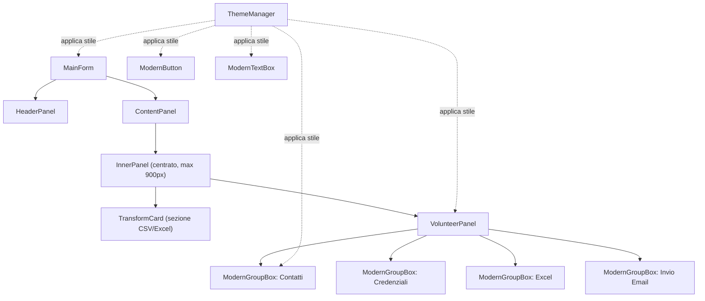

# Documento di Design Tecnico: Modern UI Redesign

## Overview

Questo documento descrive il design tecnico per la modernizzazione dell'interfaccia utente dell'applicazione WinForms C# "Auser Gestione Trasporti". L'obiettivo è trasformare l'UI esistente in un'interfaccia moderna e coerente, adottando la palette cromatica ufficiale (Bianco #FFFFFF, Carbone #393939, Verde #009246, Ambra #FAB900), il logo aziendale, e un layout responsive centrato, senza alterare la logica di business esistente.

Il redesign introduce:
- Un `ThemeManager` statico come punto centralizzato di stile
- Controlli custom (`ModernButton`, `ModernTextBox`, `ModernGroupBox`) con rendering personalizzato via `OnPaint`
- Un `HeaderPanel` con logo e titolo
- Un layout a `ContentPanel` scrollabile con pannello interno centrato
- Aggiornamento di `MainForm` e `VolunteerPanel` per usare i nuovi controlli

## Architecture



### Principi architetturali

- **Separazione delle responsabilità**: `ThemeManager` gestisce solo lo stile, non la logica. I controlli custom gestiscono solo il rendering, non la business logic.
- **Nessuna modifica alla business logic**: `IApplicationController`, `IVolunteerNotificationController`, `ExcelManager`, `VolunteerManager`, `EmailService` rimangono invariati.
- **Compatibilità con i test esistenti**: I test esistenti non devono essere modificati. I nuovi controlli custom estendono i controlli WinForms standard.

## Components and Interfaces

### ThemeManager (`UI/ThemeManager.cs`)

Classe statica con costanti di colore, font e metodi di applicazione stile.

```csharp
public static class ThemeManager
{
    // Palette
    public static readonly Color ColorBackground = Color.White;           // #FFFFFF
    public static readonly Color ColorPrimary    = Color.FromArgb(0x39, 0x39, 0x39); // #393939 Carbone
    public static readonly Color ColorAccent     = Color.FromArgb(0x00, 0x92, 0x46); // #009246 Verde
    public static readonly Color ColorSecondary  = Color.FromArgb(0xFA, 0xB9, 0x00); // #FAB900 Ambra
    public static readonly Color ColorDisabled   = Color.FromArgb(0xCC, 0xCC, 0xCC); // #CCCCCC
    public static readonly Color ColorDisabledText = Color.FromArgb(0x88, 0x88, 0x88);
    public static readonly Color ColorBorderLight = Color.FromArgb(0xE0, 0xE0, 0xE0);
    public static readonly Color ColorRowAlt     = Color.FromArgb(0xF5, 0xF5, 0xF5);

    // Font
    public static readonly Font FontTitle      = new Font("Segoe UI", 24F, FontStyle.Bold);
    public static readonly Font FontSubtitle   = new Font("Segoe UI", 12F, FontStyle.Bold);
    public static readonly Font FontNormal     = new Font("Segoe UI", 10F);
    public static readonly Font FontSmall      = new Font("Segoe UI", 9F);
    public static readonly Font FontSectionLabel = new Font("Segoe UI", 14F, FontStyle.Bold);

    // Metodi di applicazione stile
    public static void ApplyPrimary(ModernButton btn);
    public static void ApplySecondary(ModernButton btn);
    public static void ApplyAccent(ModernButton btn);
    public static void ApplyStyle(TextBox txt);
    public static void ApplyStyle(Label lbl);
    public static void ApplyStyle(ListView lv);
    public static void ApplyStyle(ComboBox cmb);
    public static void ApplyStyle(ProgressBar pb);
}
```

### ModernButton (`UI/Controls/ModernButton.cs`)

Estende `Button`. Override di `OnPaint` per angoli arrotondati (raggio 6px), effetti hover/press, e stati disabilitato/abilitato.

```csharp
public class ModernButton : Button
{
    public enum ButtonStyle { Primary, Secondary, Accent }
    public ButtonStyle Style { get; set; } = ButtonStyle.Primary;

    private bool _isHovered;
    private bool _isPressed;

    protected override void OnPaint(PaintEventArgs e);
    protected override void OnMouseEnter(EventArgs e);
    protected override void OnMouseLeave(EventArgs e);
    protected override void OnMouseDown(MouseEventArgs e);
    protected override void OnMouseUp(MouseEventArgs e);
}
```

Colori per stato:
- **Primary**: sfondo Verde (#009246), testo Bianco. Hover: +15% luminosità. Press: -20%.
- **Secondary**: sfondo Carbone (#393939), testo Bianco.
- **Accent**: sfondo Ambra (#FAB900), testo Carbone (#393939).
- **Disabled**: sfondo #CCCCCC, testo #888888.

### ModernTextBox (`UI/Controls/ModernTextBox.cs`)

Estende `TextBox`. Override di `OnPaint` per bordo inferiore colorato. Gestisce focus/blur per cambio colore bordo. Supporta placeholder text.

```csharp
public class ModernTextBox : TextBox
{
    public string PlaceholderText { get; set; } = string.Empty;
    private bool _isFocused;

    protected override void OnPaint(PaintEventArgs e);
    protected override void OnGotFocus(EventArgs e);   // bordo Ambra
    protected override void OnLostFocus(EventArgs e);  // bordo Verde
    protected override void WndProc(ref Message m);    // per placeholder
}
```

### ModernGroupBox (`UI/Controls/ModernGroupBox.cs`)

Estende `GroupBox`. Override di `OnPaint` per intestazione con sfondo Carbone, testo Bianco, bordo grigio chiaro con angoli arrotondati (4px).

```csharp
public class ModernGroupBox : GroupBox
{
    protected override void OnPaint(PaintEventArgs e);
}
```

### HeaderPanel (`UI/HeaderPanel.cs`)

Pannello superiore del MainForm. Altezza fissa 80px, sfondo Carbone. Carica `logo/Auser_logo.png` con `InterpolationMode.HighQualityBicubic`. Gestisce gracefully l'assenza del file logo.

```csharp
public class HeaderPanel : Panel
{
    private Image? _logo;
    private Label _titleLabel;

    public HeaderPanel();
    private void LoadLogo();
    protected override void OnPaint(PaintEventArgs e);
}
```

### MainForm (aggiornato)

Modifiche rispetto all'implementazione attuale:
- Aggiunta di `HeaderPanel` (Anchor Top+Left+Right, Height=80)
- Aggiunta di `ContentPanel` (AutoScroll=true, Anchor Top+Bottom+Left+Right)
- `ContentPanel` contiene `InnerPanel` (max 900px, centrato)
- `InnerPanel` contiene la `TransformCard` e il `VolunteerPanel`
- Gestione evento `Resize` per ricalcolare posizione/larghezza di `InnerPanel`
- `MinimumSize = new Size(700, 600)`
- `BackColor = Color.White`
- Tutti i controlli esistenti migrati a `ModernButton` e stile ThemeManager

Layout del MainForm:

```
┌─────────────────────────────────────────────────────┐
│  HeaderPanel (80px, sfondo #393939)                 │
│  [Logo]  Auser Gestione Trasporti                   │
├─────────────────────────────────────────────────────┤
│  ContentPanel (scrollabile, sfondo bianco)          │
│  ┌───────────────────────────────────────────────┐  │
│  │  InnerPanel (max 900px, centrato)             │  │
│  │  ┌─────────────────────────────────────────┐  │  │
│  │  │  TransformCard                          │  │  │
│  │  │  [Seleziona CSV]  percorso...           │  │  │
│  │  │  [Seleziona Excel]  percorso...         │  │  │
│  │  │  [Elabora]  [Scarica]                   │  │  │
│  │  │  stato...                               │  │  │
│  │  └─────────────────────────────────────────┘  │  │
│  │  ┌─────────────────────────────────────────┐  │  │
│  │  │  VolunteerPanel                         │  │  │
│  │  └─────────────────────────────────────────┘  │  │
│  └───────────────────────────────────────────────┘  │
└─────────────────────────────────────────────────────┘
```

### VolunteerPanel (aggiornato)

Modifiche rispetto all'implementazione attuale:
- Tutti i `GroupBox` sostituiti con `ModernGroupBox`
- Tutti i `Button` sostituiti con `ModernButton` con stile appropriato
- I `TextBox` per credenziali Gmail sostituiti con `ModernTextBox`
- `ListView` stilizzata tramite `ThemeManager.ApplyStyle`
- `ProgressBar` stilizzata tramite `ThemeManager.ApplyStyle`
- Dialogo "Aggiungi Contatto" aggiornato con `ModernTextBox` e `ModernButton`
- Anchor `Left | Right | Top` su tutti i controlli espandibili

## Data Models

Non sono introdotti nuovi modelli di dati. Il redesign è puramente UI. Le strutture dati esistenti (`VolunteerManager`, `ConfigurationService`, ecc.) rimangono invariate.

### Costanti di stile (ThemeManager)

| Nome | Valore | Uso |
|------|--------|-----|
| ColorBackground | #FFFFFF | Sfondo form, pannelli, textbox |
| ColorPrimary | #393939 | Testo principale, header, GroupBox header |
| ColorAccent | #009246 | Pulsanti Primary, bordo TextBox, ProgressBar |
| ColorSecondary | #FAB900 | Pulsanti Accent, bordo TextBox focus |
| ColorDisabled | #CCCCCC | Pulsanti disabilitati |
| ColorBorderLight | #E0E0E0 | Bordi card, GroupBox |
| ColorRowAlt | #F5F5F5 | Righe alternate ListView |
| FontTitle | Segoe UI 24pt Bold | Titoli principali |
| FontSubtitle | Segoe UI 12pt Bold | Sottotitoli |
| FontNormal | Segoe UI 10pt | Testo normale, pulsanti |
| FontSmall | Segoe UI 9pt | Testo secondario, label |
| FontSectionLabel | Segoe UI 14pt Bold | Etichette sezione |

## Correctness Properties

*A property is a characteristic or behavior that should hold true across all valid executions of a system — essentially, a formal statement about what the system should do. Properties serve as the bridge between human-readable specifications and machine-verifiable correctness guarantees.*

### Property 1: ThemeManager applica colori coerenti per variante

*For any* istanza di `ModernButton`, dopo aver applicato una variante di stile tramite `ThemeManager` (Primary, Secondary o Accent), il colore di sfondo e il colore del testo del pulsante devono corrispondere esattamente ai valori della palette definita per quella variante.

**Validates: Requirements 1.4, 1.5**

### Property 2: Pannello interno centrato si adatta al resize

*For any* larghezza del `ContentPanel`, dopo un evento di resize, la larghezza del pannello interno deve essere `min(larghezza_disponibile - 40, 900)` e la sua posizione X deve essere `max(20, (larghezza_disponibile - larghezza_pannello) / 2)`.

**Validates: Requirements 3.3, 3.4, 3.5, 9.2, 9.3**

### Property 3: ModernTextBox cambia colore bordo al focus e lo ripristina al blur

*For any* istanza di `ModernTextBox`, simulando il focus il colore del bordo deve diventare Ambra (#FAB900), e simulando la perdita del focus il colore del bordo deve tornare Verde (#009246) — ripristinando lo stato originale (round-trip).

**Validates: Requirements 5.2, 5.3**

### Property 4: ModernButton disabilitato mostra colori non interattivi

*For any* istanza di `ModernButton` con qualsiasi stile (Primary, Secondary, Accent), quando il pulsante è disabilitato (`Enabled = false`), il colore di sfondo usato nel rendering deve essere #CCCCCC e il colore del testo deve essere #888888.

**Validates: Requirements 4.5**

### Property 5: Etichetta di stato riflette il tipo di messaggio

*For any* messaggio passato a `ShowSuccessMessage`, il `ForeColor` dell'etichetta di stato deve essere Verde (#009246); *for any* messaggio passato a `ShowErrorMessage`, il `ForeColor` deve essere Rosso (#D32F2F).

**Validates: Requirements 7.6**

### Property 6: VolunteerPanel applica il tema a tutti i controlli principali

*For any* istanza di `VolunteerPanel` inizializzata, tutti i controlli `ModernButton` devono avere il colore di sfondo corrispondente alla loro variante di stile assegnata, e tutti i `ModernTextBox` devono avere `BackColor = Color.White` e `ForeColor = Color.FromArgb(0x39, 0x39, 0x39)`.

**Validates: Requirements 8.1, 8.3, 8.4, 8.5**

### Property 7: ModernTextBox mostra placeholder quando vuoto e senza focus

*For any* istanza di `ModernTextBox` con `PlaceholderText` configurato, quando il testo è vuoto e il controllo non ha il focus, il testo visualizzato deve essere il placeholder in colore #AAAAAA.

**Validates: Requirements 5.5**

## Error Handling

| Scenario | Comportamento atteso |
|----------|---------------------|
| File `logo/Auser_logo.png` non trovato | `HeaderPanel` cattura l'eccezione, visualizza solo il testo titolo, l'avvio continua normalmente |
| File `logo/favicon_auser.png` non trovato | `MainForm` usa l'icona embedded `Resources/app_icon.ico` come fallback |
| Errore nel caricamento dell'icona embedded | `MainForm` continua senza icona (try/catch esistente mantenuto) |
| `ThemeManager` chiamato con controllo null | I metodi di applicazione stile devono gestire null gracefully (guard clause) |
| Resize a dimensioni inferiori al minimo | `MinimumSize` di WinForms impedisce il resize sotto 700x600 |

## Testing Strategy

### Approccio duale

Il testing usa sia **unit test** (esempi specifici) che **property-based test** (proprietà universali), complementari tra loro.

**Libreria PBT**: FsCheck (già presente nel progetto come dipendenza NuGet).

**Unit test** — esempi specifici e casi limite:
- Verifica costanti di colore e font in `ThemeManager`
- Verifica proprietà di layout di `HeaderPanel` dopo inizializzazione (altezza, anchor, sfondo)
- Verifica `MinimumSize` del `MainForm`
- Verifica che `ContentPanel` abbia `AutoScroll = true`
- Verifica che i `GroupBox` in `VolunteerPanel` siano istanze di `ModernGroupBox`
- Verifica che i `TextBox` credenziali siano istanze di `ModernTextBox`
- Verifica proprietà del dialogo "Aggiungi Contatto" (dimensioni, colori, tipi controlli)
- Verifica che il titolo del form sia "Auser Gestione Trasporti"
- Verifica che l'avvio non lanci eccezioni con logo mancante

**Property-based test** — proprietà universali (min 100 iterazioni ciascuno):
- Property 1: ThemeManager applica colori coerenti per variante
- Property 2: Pannello interno centrato si adatta al resize
- Property 3: ModernTextBox round-trip focus/blur colore bordo
- Property 4: ModernButton disabilitato mostra colori non interattivi
- Property 5: Etichetta di stato riflette il tipo di messaggio
- Property 6: VolunteerPanel applica il tema a tutti i controlli principali
- Property 7: ModernTextBox mostra placeholder quando vuoto e senza focus

**Tag format per i property test**:
`// Feature: modern-ui-redesign, Property {N}: {testo_property}`

**Configurazione FsCheck**:
```csharp
var config = new Configuration { MaxNbOfTest = 100 };
```

**File di test**:
- `Tests/ModernUIDesignTests.cs` — unit test esempi
- `Tests/ModernUIDesignPropertyTests.cs` — property-based test con FsCheck
