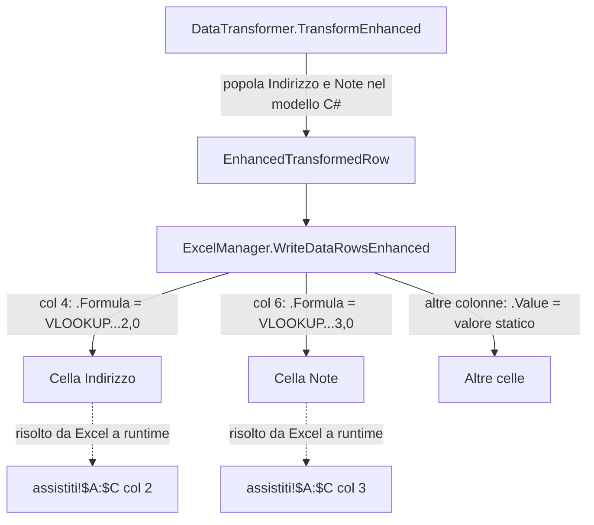

# Design Document: vlookup-indirizzo-note

## Overview

Questa feature modifica il metodo `WriteDataRowsEnhanced` di `ExcelManager` per scrivere formule Excel VLOOKUP nelle colonne "Indirizzo" (colonna 4) e "Note" (colonna 6) del foglio di output, invece dei valori statici attualmente scritti. Le formule fanno riferimento al foglio "assistiti" nella stessa cartella di lavoro, usando il nome dell'assistito (colonna C) come chiave di ricerca. Il modello C# `EnhancedTransformedRow` e il flusso `DataTransformer`/`LookupService` rimangono invariati.

## Architecture

La modifica è chirurgica e limitata a un singolo metodo in un singolo file:

```
ExcelManager.WriteDataRowsEnhanced()
  ├── col 4 (Indirizzo): cell.Formula = $"VLOOKUP(C{currentRow},assistiti!$A:$C,2,0)"  [CAMBIA]
  └── col 6 (Note):      cell.Formula = $"VLOOKUP(C{currentRow},assistiti!$A:$C,3,0)"  [CAMBIA]
```

Tutti gli altri componenti rimangono invariati:

```
DataTransformer.TransformEnhanced()
  └── LookupService.Lookup()  →  EnhancedTransformedRow.Indirizzo / .Note  [INVARIATO]
```



## Components and Interfaces

### ExcelManager (Services/ExcelManager.cs)

Unico componente modificato. Il metodo `WriteDataRowsEnhanced` cambia due assegnazioni:

**Prima (attuale):**
```csharp
// Column 4: Indirizzo
sheet.Worksheet.Cells[currentRow, col++].Value = row.Indirizzo;

// Column 6: Note
sheet.Worksheet.Cells[currentRow, col++].Value = row.Note;
```

**Dopo:**
```csharp
// Column 4: Indirizzo - formula VLOOKUP
sheet.Worksheet.Cells[currentRow, col++].Formula = $"VLOOKUP(C{currentRow},assistiti!$A:$C,2,0)";

// Column 6: Note - formula VLOOKUP
sheet.Worksheet.Cells[currentRow, col++].Formula = $"VLOOKUP(C{currentRow},assistiti!$A:$C,3,0)";
```

La variabile `col` viene incrementata tramite `col++` come prima, quindi la logica di avanzamento colonna è identica.

### DataTransformer / LookupService / EnhancedTransformedRow

Nessuna modifica. I campi `Indirizzo` e `Note` di `EnhancedTransformedRow` continuano ad essere popolati da `LookupService` durante la trasformazione. Questi valori C# rimangono disponibili nel modello (utili per logging, debug, o usi futuri) ma non vengono più scritti come valori statici nel foglio Excel.

## Data Models

Nessuna modifica ai modelli dati. `EnhancedTransformedRow` mantiene i campi `Indirizzo` e `Note` come `string`.

La struttura del foglio di output rimane a 12 colonne:

| Col | Nome           | Tipo scrittura       |
|-----|----------------|----------------------|
| 1   | Data           | Valore (DateTime)    |
| 2   | Partenza       | Valore (string)      |
| 3   | Assistito      | Valore (string)      |
| 4   | Indirizzo      | **Formula VLOOKUP**  |
| 5   | Destinazione   | Valore (string)      |
| 6   | Note           | **Formula VLOOKUP**  |
| 7   | Auto           | Valore (string)      |
| 8   | Volontario     | Valore (string)      |
| 9   | Arrivo         | Valore (string)      |
| 10  | Avv            | Valore (string)      |
| 11  | Indirizzo Gasnet | Valore (string)    |
| 12  | Note Gasnet    | Valore (string)      |

Formato formula per la riga Excel `r`:
- Indirizzo: `=VLOOKUP(C{r},assistiti!$A:$C,2,0)`
- Note:      `=VLOOKUP(C{r},assistiti!$A:$C,3,0)`

## Correctness Properties

*A property is a characteristic or behavior that should hold true across all valid executions of a system — essentially, a formal statement about what the system should do. Properties serve as the bridge between human-readable specifications and machine-verifiable correctness guarantees.*

### Property 1: Formule VLOOKUP scritte per Indirizzo e Note

*For any* lista di `EnhancedTransformedRow` e qualsiasi `startRow`, dopo la chiamata a `WriteDataRowsEnhanced`, ogni cella nella colonna 4 (Indirizzo) e nella colonna 6 (Note) deve avere la proprietà `.Formula` non vuota e contenente `VLOOKUP`.

**Validates: Requirements 1.1, 1.4, 2.1, 2.4**

### Property 2: Correttezza del numero di riga nella formula

*For any* lista di `EnhancedTransformedRow` di lunghezza N e qualsiasi `startRow`, dopo la chiamata a `WriteDataRowsEnhanced`, la formula nella riga i-esima (0-indexed) deve essere esattamente:
- Colonna 4: `VLOOKUP(C{startRow+i},assistiti!$A:$C,2,0)`
- Colonna 6: `VLOOKUP(C{startRow+i},assistiti!$A:$C,3,0)`

**Validates: Requirements 1.2, 2.2, 4.1, 4.2, 4.3**

### Property 3: Colonne non interessate rimangono invariate

*For any* lista di `EnhancedTransformedRow`, dopo la chiamata a `WriteDataRowsEnhanced`, tutte le colonne diverse da 4 e 6 devono avere `.Formula` vuota e `.Value` uguale al valore atteso dal modello (nessuna formula introdotta per errore).

**Validates: Requirements 3.1, 3.2**

### Property 4: DataTransformer popola ancora Indirizzo e Note nel modello C#

*For any* lista di `ServiceAppointment` con assistiti presenti nel lookup, dopo `TransformEnhanced`, i campi `Indirizzo` e `Note` di ogni `EnhancedTransformedRow` risultante devono essere non vuoti.

**Validates: Requirements 3.3**

## Error Handling

- Se il nome dell'assistito non è presente nel foglio "assistiti", Excel mostrerà `#N/A` nella cella. Questo è il comportamento atteso e desiderato (req. 1.3, 2.3): la gestione dell'errore è delegata a Excel.
- `WriteDataRowsEnhanced` non deve lanciare eccezioni per valori mancanti in `row.Indirizzo` o `row.Note`, poiché questi campi non vengono più usati per la scrittura nel foglio.
- Il controllo `if (rows == null) return;` esistente rimane invariato.

## Testing Strategy

### Unit Tests

Verificare esempi specifici e casi limite:
- Una singola riga con `startRow = 2`: la formula in col 4 deve essere `VLOOKUP(C2,assistiti!$A:$C,2,0)` e in col 6 `VLOOKUP(C2,assistiti!$A:$C,3,0)`.
- Verificare che le colonne 1, 2, 3, 5, 7–12 abbiano `.Formula` vuota e `.Value` corretto.
- Caso limite: lista vuota — nessuna cella scritta, nessuna eccezione.

### Property-Based Tests

Libreria: **FsCheck** (già disponibile nell'ecosistema .NET) o **CsCheck**.

Configurazione: minimo 100 iterazioni per proprietà.

**Property Test 1** — Formule VLOOKUP presenti
```
// Feature: vlookup-indirizzo-note, Property 1: VLOOKUP formulas written for Indirizzo and Note
// For any list of rows and startRow, col 4 and col 6 must have .Formula containing VLOOKUP
```

**Property Test 2** — Correttezza del numero di riga
```
// Feature: vlookup-indirizzo-note, Property 2: Row number accuracy in formula
// For any list of rows and startRow, formula at row i must reference row (startRow + i)
```

**Property Test 3** — Colonne non interessate invariate
```
// Feature: vlookup-indirizzo-note, Property 3: Other columns unaffected
// For any list of rows, columns != 4 and != 6 must have empty Formula
```

**Property Test 4** — DataTransformer popola il modello
```
// Feature: vlookup-indirizzo-note, Property 4: DataTransformer still populates model fields
// For any appointments with known assistiti, Indirizzo and Note fields must be non-empty
```

Ogni property test deve essere implementato da un singolo test parametrizzato con generatori casuali per `List<EnhancedTransformedRow>` e `startRow`.
